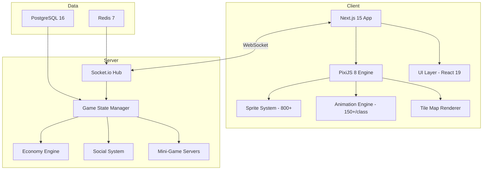

<div align="center">
  
  <br><br>

# Anadolu Realm

### Turkish Digital Metropolis MMO - Build Your Empire in a Living Pixel Art World
### Turk Dijital Metropol MMO - Canli Piksel Sanat Dunyasinda Imparatorlugunuzu Kurun

[](https://anatolia.ailydian.com)
[]()
[]()

</div>

---

## Preview

<div align="center">
  
  <br><em>Anadolu Realm Landing - "Build Your Own Empire, Become a Legend, Make History" | 21 Game Systems | 500+ Assets | 5 Character Classes | 800+ Animated Sprites</em>
</div>

---

## Executive Summary

Anadolu Realm is a massively multiplayer online (MMO) simulation game set in a pixel art recreation of Istanbul and the broader Anatolian landscape. Players build empires within a living digital Turkish metropolis featuring a fully functioning economy (jobs, real estate, trading), authentic Turkish cultural mini-games (Tavla/Backgammon, Okey, Batak), and unlimited concurrent multiplayer powered by a real-time WebSocket engine.

The game targets the $200B global gaming market with a unique cultural positioning: it is the first MMO that authentically represents Turkish heritage, culture, and economic systems. Built on PixiJS 8 for 60 FPS hardware-accelerated rendering and Next.js 15 for the application shell, the platform supports 5 character classes with 150+ animations each, 30+ modular UI components, and a sophisticated server-side economy engine that mirrors real-world supply and demand dynamics.

Revenue is driven by a free-to-play model with premium cosmetics, virtual real estate, and in-game purchases. The Turkish gaming market alone is $2.1B and growing at 15% CAGR, with 36 million active gamers. Anadolu Realm's cultural authenticity creates a defensible moat that global competitors cannot easily replicate.

## Yonetici Ozeti

Anadolu Realm, Istanbul ve genis Anadolu cografyasinin piksel sanat rekreasyonunda gecen devasa cok oyunculu bir cevrimici (MMO) simulasyon oyunudur. Oyuncular; tam islevsel bir ekonomi (isler, gayrimenkul, ticaret), otantik Turk kulturel mini oyunlari (Tavla, Okey, Batak) ve gercek zamanli WebSocket motoru ile sinrsiz es zamanli cok oyunculu deneyim sunan canli bir dijital Turk metropolunde imparatorluklar kurar.

Oyun, benzersiz bir kulturel konumlandirmayla 200 milyar dolarlik kuresel oyun pazarini hedeflemektedir: Turk mirasini, kulturunu ve ekonomik sistemlerini otantik bicimde temsil eden ilk MMO'dur. 60 FPS donanim hizlandirmali goruntuleme icin PixiJS 8 ve uygulama kabugu icin Next.js 15 uzerine insa edilen platform; her biri 150+ animasyona sahip 5 karakter sinifi, 30+ moduler UI bileseni ve gercek dunya arz-talep dinamiklerini yansitan sofistike bir sunucu tarafi ekonomi motorunu desteklemektedir.

Gelir, premium kozmetikler, sanal gayrimenkul ve oyun ici satin alimlarla birlikte ucretsiz oynama modeliyle elde edilmektedir. Tek basina Turk oyun pazari 2.1 milyar dolar buyuklugunde olup %15 CAGR ile buyumektedir ve 36 milyon aktif oyuncuya sahiptir.

---

## Key Metrics

| Metric | Value |
|--------|-------|
| Game Systems | 21 |
| Total Assets | 500+ |
| Character Classes | 5 |
| Animated Sprites | 800+ |
| UI Components | 30+ |
| Rendering | 60 FPS (PixiJS 8) |
| Mini-Games | 3 (Tavla, Okey, Batak) |
| Character Animations | 150+ per class |

---

## Revenue Model & Projections

### Business Model

Free-to-play with multiple monetization streams:
- **Premium Cosmetics**: Character skins, outfit collections, emotes ($2-20 per item)
- **Virtual Real Estate**: Premium property locations, building upgrades ($5-50 per transaction)
- **Premium Subscription**: Monthly pass with XP boost, exclusive areas, daily rewards ($9.99/month)
- **In-Game Currency**: Purchasable virtual currency for marketplace trading
- **Season Passes**: Quarterly themed content drops with exclusive rewards ($14.99/season)

### 5-Year Revenue Forecast

| Year | MAU | Paying Users | ARR | Growth |
|------|-----|-------------|-----|--------|
| Y1 | 20K | 2K | $80K | - |
| Y2 | 80K | 8K | $350K | 338% |
| Y3 | 250K | 30K | $1.5M | 329% |
| Y4 | 500K | 65K | $4M | 167% |
| Y5 | 1M | 140K | $10M | 150% |

---

## Market Opportunity

| Segment | Value |
|---------|-------|
| **TAM** (Global Gaming Market) | $200B |
| **SAM** (MMO + Simulation Segment) | $28B |
| **SOM** (Turkish-Cultural Gaming Niche) | $800M |

Key growth drivers:
- Turkey: 36M active gamers, $2.1B market, 15% CAGR
- MENA region: 400M+ potential players with cultural affinity
- Pixel art revival trend in global gaming (Stardew Valley, Habbo Hotel 2.0)
- Metaverse and virtual economy interest driving MMO resurgence

---

## Tech Stack


| Layer | Technology |
|:------|:-----------|
| Frontend Framework | Next.js 15, React 19 |
| Game Engine | PixiJS 8 (60 FPS, hardware-accelerated) |
| Animation | GSAP, Three.js |
| Language | TypeScript 5 |
| Real-Time | Socket.io (unlimited concurrent) |
| Database | PostgreSQL 16 + Prisma ORM |
| Cache | Redis 7 |
| Build System | Turborepo |
| Container | Docker, Docker Compose |

---

## Competitive Advantages

- **Cultural Moat**: Only MMO authentically representing Turkish heritage, language, and traditions - impossible for global studios to replicate
- **Proven Mini-Games**: Tavla, Okey, and Batak have 100M+ players in Turkey alone - built-in viral loop
- **Dual Engagement Model**: Open-world exploration + competitive mini-games ensures high session time and retention
- **Modern Tech Stack**: PixiJS 8 + Next.js 15 delivers console-quality pixel art at 60 FPS in the browser - zero download barrier
- **MENA Expansion**: Cultural affinity with 400M+ Arabic-speaking and Turkic-speaking populations across MENA and Central Asia

---

## Architecture



---

## Getting Started

```bash
# Clone the repository
git clone https://github.com/AiLydian/anatolia.ailydian.com.git
cd anatolia.ailydian.com

# Install dependencies
pnpm install

# Configure environment
cp apps/web/.env.example apps/web/.env.local
cp apps/server/.env.example apps/server/.env

# Run database migrations
pnpm db:migrate

# Start development
pnpm dev

# Or use Docker
docker compose up -d
```

Game client: `http://localhost:3000` | Game server: `ws://localhost:4000`

---

## Security & Compliance

| Feature | Implementation |
|---------|---------------|
| **Authentication** | JWT-based session management |
| **Rate Limiting** | All game API endpoints protected |
| **Anti-Cheat** | Server-side validation for all economy transactions |
| **Data Protection** | KVKK compliant for Turkish user data |
| **Encryption** | TLS 1.3 for all connections |
| **OWASP** | Top 10 mitigations applied |

---

## Contact

| | |
|---|---|
| Email | info@ailydian.com |
| Email | ailydian@ailydian.com |
| Web | https://ailydian.com |
| Play | https://anatolia.ailydian.com |

---

## License

Copyright (c) 2025-2026 AiLydian. All Rights Reserved.
This software is proprietary and confidential. Unauthorized copying, distribution, or modification is strictly prohibited.
