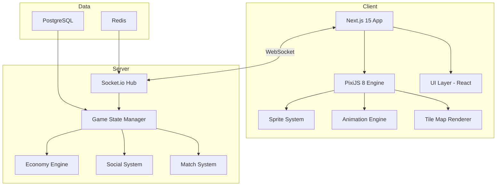

# ANADOLU REALM - Turkish Digital Metropolis MMO

> Pixel Art MMO Engine with Real-Time Economy and Turkish Cultural Heritage

[](LICENSE)
[](https://nextjs.org/)
[](https://react.dev/)
[](https://pixijs.com/)
[](https://www.typescriptlang.org/)
[](https://www.postgresql.org/)

## Overview

ANADOLU REALM is a living Turkish digital metropolis — an MMO simulation game that places players in a pixel art recreation of Istanbul and the broader Anatolian landscape. The game features a fully functioning digital economy, authentic Turkish mini-games, unlimited multiplayer via Socket.io, and 60 FPS rendering powered by PixiJS 8.

## Game Architecture



## Key Features

- **Living Turkish City Simulation** — Istanbul recreation with Anatolia expansion planned
- **60 FPS PixiJS 8 Rendering** — Hardware-accelerated 32x32 pixel art sprites at 60 frames per second
- **Unlimited Multiplayer** — Socket.io real-time engine for concurrent player management
- **5 Character Classes** — Business, Developer, Designer, Marketer, and Merchant archetypes
- **150+ Character Animations** — Fluid character movement and action sequences
- **30+ UI Components** — Modular UI system built for extensibility
- **Turkish Mini-Games** — Authentic Backgammon (Tavla), Okey, and Batak (Turkish card game)
- **Digital Economy** — Jobs, real estate, trading system, and marketplace
- **Social System** — In-game chat, friends list, guild formation, and marketplace

## Technology Stack

| Layer | Technology |
|---|---|
| Frontend Framework | Next.js 15, React 19 |
| Game Engine | PixiJS 8 |
| Animation | GSAP, Three.js |
| Real-Time | Socket.io |
| Database | PostgreSQL 16, Prisma ORM |
| State Management | Zustand |
| Language | TypeScript |
| Build | Turborepo |
| Container | Docker |

## Project Structure

```
anatolia.ailydian.com/
├── apps/
│   ├── web/              # Next.js 15 game client
│   │   ├── src/
│   │   │   ├── engine/   # PixiJS 8 game engine
│   │   │   ├── scenes/   # Game scenes and maps
│   │   │   ├── sprites/  # Character and tile sprites
│   │   │   ├── ui/       # React UI overlay
│   │   │   └── economy/  # Digital economy logic
│   │   └── public/
│   │       └── assets/   # Pixel art sprites and tiles
│   └── server/           # Socket.io game server
│       ├── src/
│       │   ├── rooms/    # Game room management
│       │   ├── economy/  # Server-side economy engine
│       │   ├── social/   # Chat, friends, guilds
│       │   └── games/    # Mini-game servers
├── packages/
│   ├── shared/           # Shared types and utilities
│   └── assets/           # Shared sprite and audio assets
├── infra/                # Infrastructure configs
└── tools/                # Build and development tools
```

## Getting Started

### Prerequisites

- Node.js 20+
- pnpm 8+
- PostgreSQL 16
- Redis 7

### Installation

```bash
# Clone the repository
git clone https://github.com/lydianai/anatolia.ailydian.com.git
cd anatolia.ailydian.com

# Install dependencies
pnpm install

# Configure environment variables
cp apps/web/.env.example apps/web/.env.local
cp apps/server/.env.example apps/server/.env

# Run database migrations
pnpm db:migrate

# Start the development stack
pnpm dev
```

The game client will be available at `http://localhost:3000` and the game server at `ws://localhost:4000`.

### Docker Quick Start

```bash
docker compose up -d
```

## Character Classes

| Class | Role | Strengths |
|---|---|---|
| Business | CEO / Entrepreneur | Real estate, trade, finance |
| Developer | Software Engineer | Tech jobs, digital products |
| Designer | Creative Director | Art, branding, content |
| Marketer | Growth Specialist | Advertising, social reach |
| Merchant | Trader | Marketplace, arbitrage, bulk deals |

## Economy System

The digital economy mirrors real-world dynamics:

- **Jobs** — Characters can work in virtual companies to earn in-game currency
- **Real Estate** — Buy, sell, and develop virtual properties across the city
- **Trading** — Player-to-player marketplace with supply and demand mechanics
- **Businesses** — Establish and run virtual companies employing other players

## Mini-Games

| Game | Type | Players |
|---|---|---|
| Tavla (Backgammon) | Strategy Board Game | 2 |
| Okey | Tile-Based Rummy | 2-4 |
| Batak | Turkish Card Game | 4 |

## Environment Variables

| Variable | Description | Required |
|---|---|---|
| `DATABASE_URL` | PostgreSQL connection string | Yes |
| `REDIS_URL` | Redis connection string | Yes |
| `NEXTAUTH_SECRET` | Authentication secret | Yes |
| `SOCKET_SERVER_URL` | WebSocket server URL | Yes |
| `NEXT_PUBLIC_GAME_SERVER` | Client-side game server URL | Yes |

## Security

See [SECURITY.md](SECURITY.md) for the vulnerability reporting policy.

- JWT-based session management
- Rate limiting on all game API endpoints
- Anti-cheat server-side validation for economy transactions
- OWASP Top 10 mitigations applied

## License

Copyright (c) 2024-2026 Lydian (AiLydian). All Rights Reserved.

This is proprietary software. See [LICENSE](LICENSE) for full terms.

---

Built by [AiLydian](https://www.ailydian.com)
